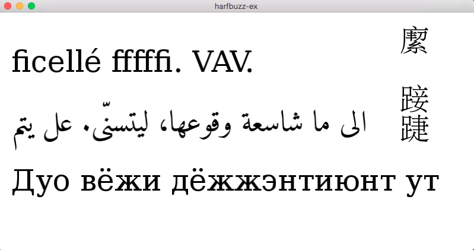

harfbuzz-example
================

Simple Harfbuzz text-shaping example with OpenGL and GLFW using Freetype. 

This project uses _CMake_, you can download it [here](http://www.cmake.org/download/) or use your favorite installation package tool like [homebrew](http://brew.sh/).
Make sure to update git submodules before you build:

```bash
git submodule update --init --recursive
```

Then build and run:
```bash
mkdir build && cd build
cmake .. && make
cd bin
./harfbuzz-example.out
```


